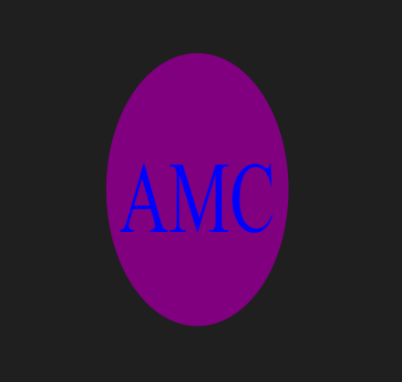
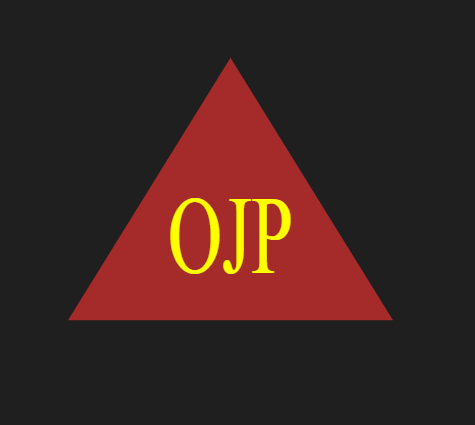
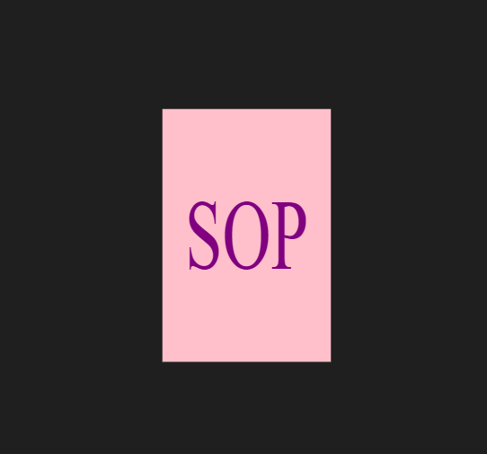

# svg_logo_maker
Object-oriented Programming Challenge: SVG Logo Maker

## Description

The objective of the project was to create a command-line application that takes in user input to generates a logo and saves it as an SVG file.

The application includes Triangle, Circle, and Square classes, as well as tests for each of these classes using Jest. 

Each shape class is tested for a render() method that returns a string for the corresponding SVG file with the given shape color.

## Table of Contents

* [Installation](#installation)
* [Usage](#usage)
* [Preview](#preview)
* [Tests](#tests)
* [Credits](#credits)
* [Questions](#links)
* [License](#license)

## Installation 

- Node 
- Inquirer package 8.2.4
- npm init
- npm jest

## Usage

Once the installation is completed, run node index.js in the commend line and user will be prompted to answer a series of questions.

WHEN user is prompted to enter a text,he/she can enter up to three (3) characters only.

WHEN user is prompted to enter text color, he/she could enter a color key word or a hehexadecimal number

WHEN user is prompted to select a shape, he/she is presented with a list of shapes to select from: circle, triangle, and square

WHEN user is prompted to enter the shape's color, he/she could enter a color key word or a hehexadecimal number

WHEN all questions are answered a SVG file is created named 'logo.svg' and the commend line displays the text "Generated logo.svg"

WHEN user opens the `logo.svg` file in a browser, a 300x200 pixel image is shown that matches the criteria that was enterd. 

## Preview

The following a walkthrough video shows the application appearance and functionality:

https://drive.google.com/file/d/1z-8Qaw7xwp7zlD1BSVbPKF0tXOs9pSMR/view

 **Mock-Ups**
 
 
 **Example #1**

The following image shows a mock-up of the generated SVG given the following input entered by the user: AMC for the text, blue for the text color, circle from the list of shapes, and purple for the shape color.  

 **Example #2**

The following image shows a mock-up of the generated SVG given the following input entered by the user: OJP for the text, yellow for the text color, sqaure from the list of shapes, and brown for the shape color. 

**Example #3**

The following image shows a mock-up of the generated SVG given the following input entered by the user: SOP for the text, purple for the text color, sqaure from the list of shapes, and pink for the shape color. 

## Tests

In order to test this application, clone the repository code and run the application in your terminal by running code 'node index.js'. Answer all the prompt questions.  

## Credits

 Classmates Joshua Hale and Gabe Harvey for their support and guidance on getting everything situated.

## Questions

https://github.com/cortesporcz/svg_logo_maker

For any additional questions, feel free to reach out via email at [cortesporcz@gmail.com](mailto:cortesporcz@gmail.com)

## License

**MIT License**

Copyright (c) [2023] [A.Cortes]

Permission is hereby granted, free of charge, to any person obtaining a copy of this software and associated documentation files (the "Software"), to deal in the Software without restriction, including without limitation the rights to use, copy, modify, merge, publish, distribute, sublicense, and/or sell copies of the Software, and to permit persons to whom the Software is furnished to do so, subject to the following conditions:

The above copyright notice and this permission notice shall be included in all copies or substantial portions of the Software.

THE SOFTWARE IS PROVIDED "AS IS", WITHOUT WARRANTY OF ANY KIND, EXPRESS OR IMPLIED, INCLUDING BUT NOT LIMITED TO THE WARRANTIES OF MERCHANTABILITY, FITNESS FOR A PARTICULAR PURPOSE AND NONINFRINGEMENT. IN NO EVENT SHALL THE AUTHORS OR COPYRIGHT HOLDERS BE LIABLE FOR ANY CLAIM, DAMAGES OR OTHER LIABILITY, WHETHER IN AN ACTION OF CONTRACT, TORT OR OTHERWISE, ARISING FROM, OUT OF OR IN CONNECTION WITH THE SOFTWARE OR THE USE OR OTHER DEALINGS IN THE SOFTWARE.

